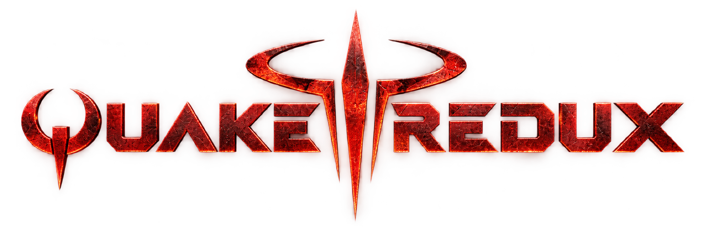
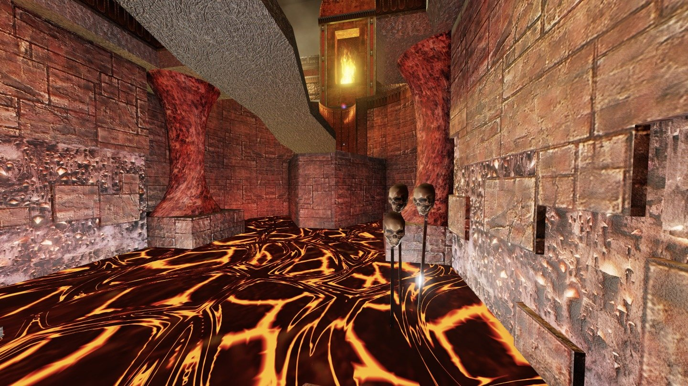
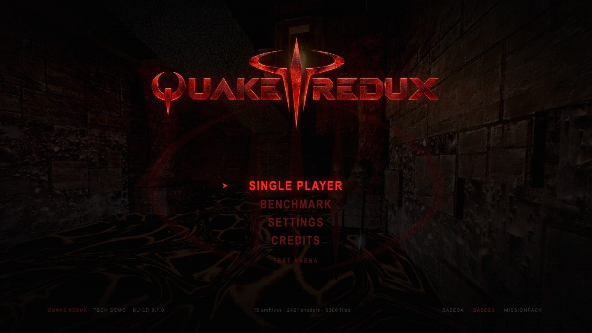
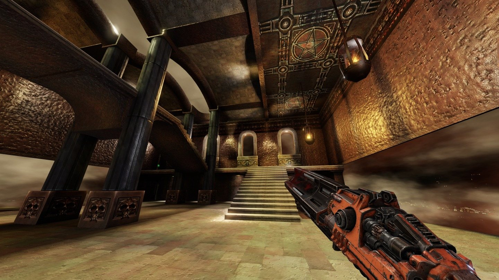
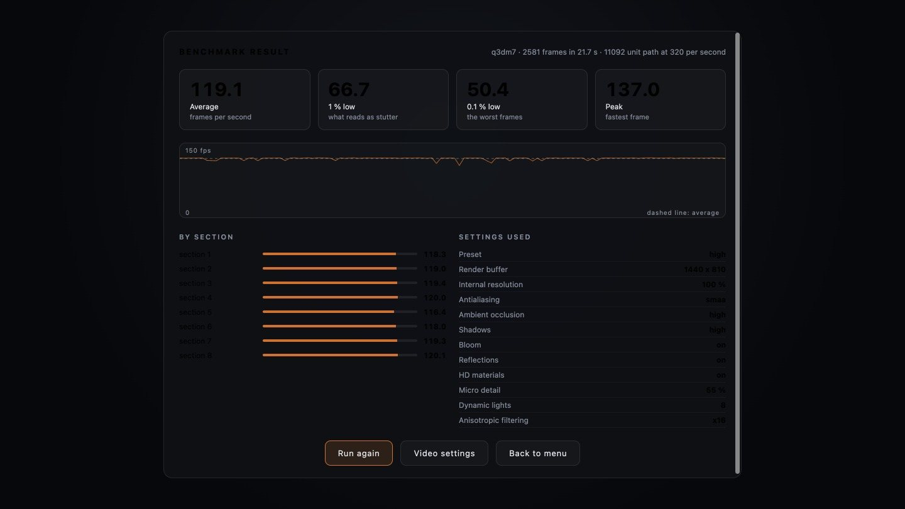
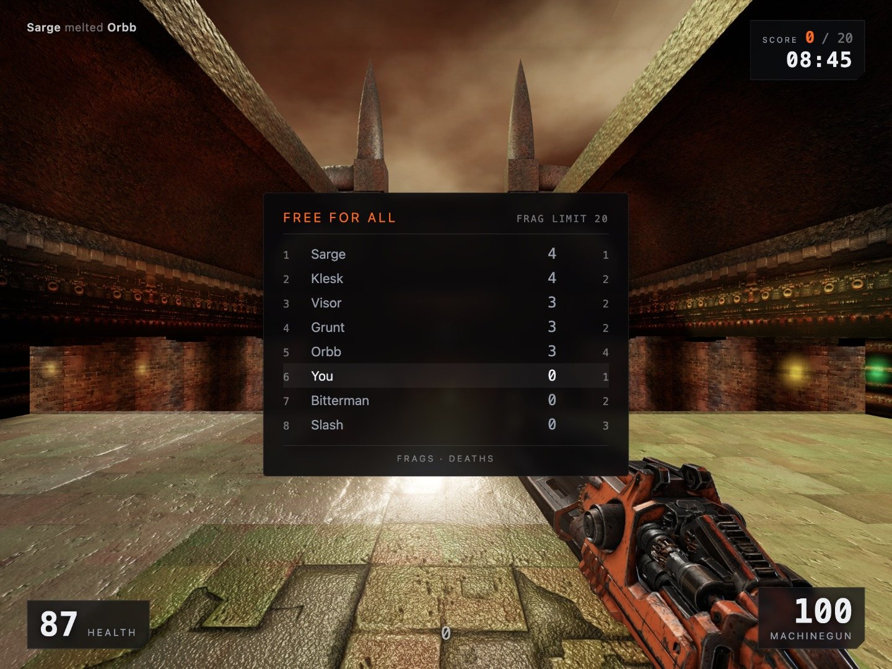
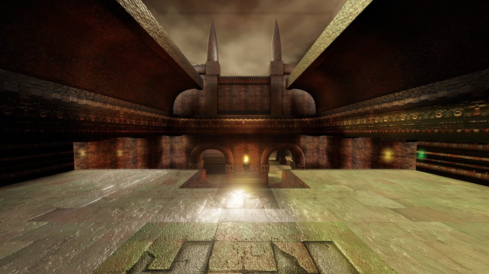
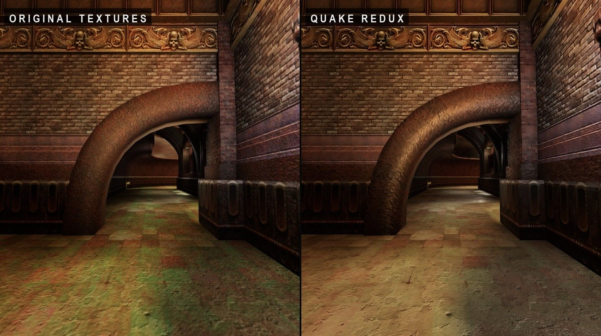
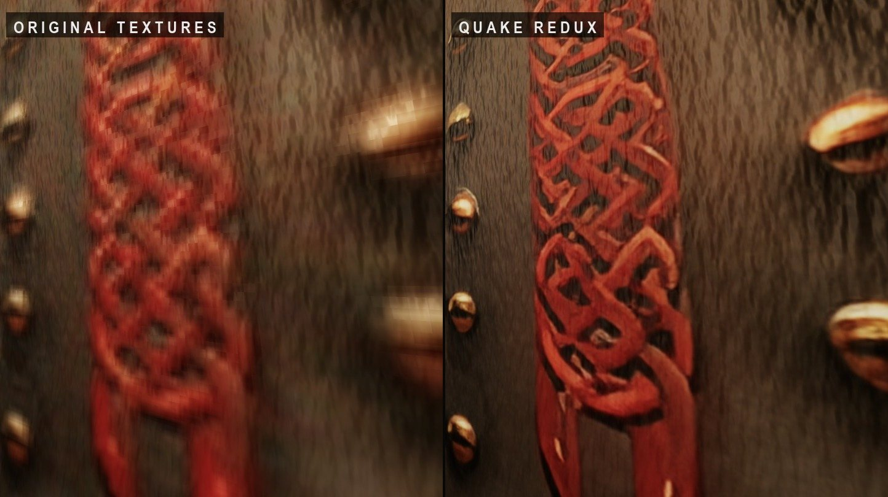

<p align="center">
  
</p>

<p align="center">
  <b>Quake III Arena</b>, rebuilt in a browser with a modern lighting and material pipeline.
</p>

<p align="center">
  <a href="https://github.com/dgadacha/Quake-III-Arena-REDUX">github.com/dgadacha/Quake-III-Arena-REDUX</a>
</p>



A browser engine that renders **Quake III Arena** with a modern lighting and
material pipeline, written from scratch in TypeScript on top of Three.js.

It reads your own installation of the game: the `.pk3` archives stay on your
machine, and no game file is redistributed here. The demo focuses on a
single arena, **q3dm7, The Temple of Retribution**, and tries to take it as far
as it goes: high definition materials derived from the original textures,
dynamic lights and shadows on top of the map's baked lighting, reflection
probes, ambient occlusion, a colour grading pass per map, and the original
movement code at 125 Hz.

The point is not to ship another source port. The point is to answer one
question honestly, on one map, with numbers: **how far can a 1999 arena be
pushed with today's rendering, without touching a single byte of its data?**

---

## What it is, and what it is not

It **is** an engine: `.pk3` archives read over HTTP range requests, BSP v46
geometry, lightmaps, the light grid, `.shader` scripts, MD3 models, Q3 player
movement, and a rendering chain rebuilt for 2026 hardware.

It **plays**: a Free For All match against seven bots, with the frag and time
limits, the weapons and items of the map, and opponents that navigate it with
the map's own navigation data. There is no network play and no other game
mode.

It does **not** contain game data. Maps, textures, models and sounds are read
from your installation at runtime; the derived HD materials are written to a
folder that git ignores. Clone it and you get the code and the images on
this page, nothing else.

---

## Requirements

| | |
| --- | --- |
| A copy of Quake III Arena | the `baseq3` folder with its `pak0.pk3` … `pak8.pk3` |
| Node | 18 or newer |
| A browser with WebGL 2 | BC7 texture compression is used when available, PNG otherwise |
| Python 3 | only for the offline texture pipeline, with `numpy` and `Pillow` |

The texture pipeline can also use [Real-ESRGAN](https://github.com/xinntao/Real-ESRGAN)
(the `realesrgan-ncnn-vulkan` binary dropped in `tools/bin/`) for learned
upscaling. Without it, a Lanczos path with detail restitution is used instead,
and the validation step decides per surface which one to keep.

---

## Getting started

```bash
git clone https://github.com/dgadacha/Quake-III-Arena-REDUX.git
cd Quake-III-Arena-REDUX
npm install
```

Point the engine at your game data. `public/data` may hold real folders or
symbolic links to your installation; nothing is copied:

```bash
mkdir -p public/data
ln -s "/path/to/quake3/baseq3" public/data/baseq3
node tools/scan-data.mjs
```

`scan-data.mjs` writes the manifest the engine reads at startup: one entry per
data folder, archives sorted the way the game mounts them.

```bash
npm run dev
```

Then open <http://localhost:5213>. The menu appears first, with q3dm7 rendered
behind it, and the map is mounted in the background so that starting a match is
immediate.

Without game data the engine still runs: the **test arena** entry builds a small
room in code, with no dependency on anything id shipped.

---

## The demo



*The menu is the original composition, rendered over the arena itself: almost
black at rest, with the lava and a few torches doing the lighting.*

**Single player** sets up a match and drops you in q3dm7. The mode is the one
the game calls **Free For All**: you against seven bots, first to twenty frags
or ten minutes, whichever comes first. The setup page takes the number of
opponents, their skill on the game's five levels — `I can win` to `nightmare`,
with `hurt me plenty` in the middle — and both limits.

Death costs no time: you are back in the arena a second later, at the spawn
point furthest from everyone else, which is how the game picks it. Hold **Tab**
for the scoreboard, and it stays up when the match ends.



**Benchmark** is a real one. A camera path is built from the map's own spawn
points: the most spread out ones are picked, linked into a loop, and every leg
is checked against collision and lifted when a wall is in the way. A warm-up lap
covers the whole path without recording, so that shader compilation and
reflection probe captures are not counted, and the internal resolution is frozen
for the run — otherwise the result measures the resolution, not the settings.
The report gives the average, the 1 % and 0.1 % lows, the frame rate section by
section, the frame time curve, and the settings used. Frames where the browser
suspended rendering are discarded and counted separately.



**Settings** keeps twelve choices, the ones that change what you see, what you
hear, or what the machine has to swallow: preset, render scale, dynamic
resolution, antialiasing, textures, shadows, ambient occlusion, bloom,
reflections, anisotropic filtering, sound, brightness. The `classic` preset is
the comparison point: it brings the image back to something close to the 1999
rendering.

**Sound.** The menu uses the game's own four samples, read from your archives
like everything else: `menu2` when the selection moves, `menu1` on validation,
`menu3` on the way back, `menu4` when an entry is not available. A hundred
milliseconds each, metallic, exactly as in 1999. Underneath runs an ambience
this project generates rather than borrows — two very low detuned drones and a
filtered breath, at five percent of the volume — so the lava room behind the
menu is not silent. A browser refuses to play anything before the player has
touched something: the samples are read from the archives right away and
decoded on the first click or keypress. `?mute` in the address silences
everything, which is what the automated checks use.

The sixty-odd art direction knobs — contrast, temperature, lightmap floor, weapon
bob amplitude — are calibration tools, not player settings. They live in a panel
the console opens with `__q3.tuning()`.

---

## The bots



*Seven opponents, the frag limit, the clock, and the kill feed. The scoreboard
is the game's: mode, limit, frags and deaths.*

**They walk on the map's own plan.** Next to each `.bsp`, the game's compiler
wrote an `.aas`: the level cut into areas where a player fits standing, and,
between those areas, every way to get across — walk, jump, drop off a ledge,
take a teleporter, ride a jump pad — each with the cost the compiler measured.
q3dm7 declares 3 599 areas and 5 308 of those crossings. Reading that file is
why a bot takes the jump the level was built around instead of walking into the
wall below it: the route is the game's, not ours. The only thing added is the
shortest path, computed once per goal and shared by everyone chasing it.

**They move like you do.** A bot produces nothing but commands — forward,
right, jump, view angles — and they go through the same 125 Hz movement code as
the player. So a bot slides along corridors, climbs steps, gets thrown by a
rocket and picks up speed off a jump pad exactly as you do.

**They are lit by the room.** A wall carries its light baked into its
lightmap; a body that moves carries nothing. The game solves this with the
light grid — one cell every 64 by 64 by 128 units, each holding an ambient
colour, a dominant colour and the direction it comes from — and that is what
lights the bodies here, sampled once per frame per body. A fighter standing by
the fire turns orange, one in the teleporter's glow turns blue, one deep in the
lower corridors goes nearly black. Measured on q3dm7, in that order: `c3a477`,
`0e5193`, `090805`.

**They come apart.** When a hit overshoots what was left of someone's health by
forty points — the game's own threshold — there is no death animation: the body
bursts into eleven pieces, the ten gib models from the archives, which fall,
bounce off the geometry with the game's impact sounds and come to rest. Below
that, they take one of the three death animations instead.

**What they decide.** Head for what is worth taking, weighing the value of an
item against the cost of the path; engage what they see; hold the distance
their weapon likes, which is why a bot with a shotgun closes in and one with a
railgun backs away; strafe during the exchange; and shoot with a reaction time
and an aim error. Difficulty is those two numbers and a few habits, not
accuracy taken away afterwards — the bots of the game have a whole subsystem of
fuzzy logic and long term goals, and that is not what is rebuilt here.

---

## How the rendering works



*The lightmaps carry the indirect light the original compiler computed; the
light grid gives it a direction, which is what makes the relief readable at
all.*

**Geometry and visibility.** BSP faces are grouped per shader into as few meshes
as possible, and each mesh keeps the ranges of its faces so the map's own
visibility table can narrow the index buffer per cluster instead of splitting the
world into one mesh per leaf.

**Baked lighting, kept.** The map's lightmaps are the ground truth: they carry
the indirect light that only the original compiler knew. They are sampled on
their own UV set, lifted by a floor so dark corners keep their material, and
everything else is added on top.

**Direction from the light grid.** A lightmap says how much light reaches a
surface, never from where. The map's light grid does carry the direction, and it
is what makes relief, roughness and metal exist at all: without it, a surface is
a flat fill, which is exactly what 1999 looked like.

**Dynamic lights.** The map's light entities become a pool of point and spot
lights, with static shadow maps rendered once per assignment. The number of
active lights never changes — a changing light count recompiles every material —
and lights fade in and out over a quarter of a second instead of popping.

**Reflection probes.** Several cube captures are taken across the map, one probe
per frame once the map is on screen, and the nearest one feeds the environment
of metals and liquids. Without an environment to reflect, a metal is a dark
fill, which is why the metalness ceiling depends on whether probes are ready.

**Surfaces read from the scripts.** Emission, waves, animated frames, liquid
layers, scroll and turbulence all come from the game's own `.shader` files. The
lava, for instance, is two crossed layers at the scales the script declares, with
the turbulence computed from world position the way the game does it, and its
emission follows the heat of its veins rather than the whole sheet.

**Post-processing.** One HDR buffer, ambient occlusion at a fraction of the
buffer, bloom, then a single pass that does ACES tone mapping and the grading
together, with contrast pivoted at middle grey and per-map intentions on top of
the user's settings. The held weapon is drawn after the world and after its
occlusion, but before the grading, so it belongs to the image instead of sitting
on it.

---

## The HD texture pipeline



*Same view, same lighting, same settings. Only the material source changes.*

The textures are not repainted, and no external asset is introduced. Each one is
read from your archives and taken through the same offline chain:

1. **classification** — metal, stone, concrete, liquid, organic, emissive, from
   the name and from what the script declares;
2. **cleaning** — an edge-aware guided filter, dosed by the measured grain, so
   compression noise goes without taking the joints with it;
3. **upscaling** — Lanczos with detail restitution, or Real-ESRGAN, chosen per
   surface; aspect ratio is preserved, and the factor is 8 for small sources,
   4 above, capped at 2048 on the long side;
4. **seam repair** — only when the upscale made the edges worse than the original;
5. **surface maps** — height, normal, roughness with spatial variation, ambient
   occlusion, metal mask, emissive layer;
6. **validation** — structure, edges and tone distribution against the original.
   A texture that drifted too far is refused and the map keeps its original;
7. **compression** — BC7 blocks with their full mipmap chain, written beside the
   PNG. One byte per pixel instead of four, and nothing to decode at load time.

```bash
# every surface of the demo map, learned upscaling where it holds up
npm run textures:generate -- --source baseq3 --map q3dm7 --complete-map

# one texture, or one material family
npm run textures:generate -- --texture textures/gothic_trim/pitted_rust3
npm run textures:generate -- --category metal
```

The chain writes `public/generated/materials/manifest.json`. The engine reads it
and uses an HD material only for the textures listed there, so a map can be
converted surface by surface without ever breaking the rendering.

It covers models too, not just map surfaces: the eleven characters and the nine
weapons went through it, which means the skin in front of your eyes and the
bodies you shoot at are rebuilt at 1024 with their normal and ORM maps instead
of the 256 they shipped with. Four of the forty skins were refused by the
learned upscaler and re-run in Lanczos, and one — a 64 pixel rocket launcher
detail — keeps its original.



*Up close is where the original runs out of pixels, and where the relief, the
roughness and the metal mask start to carry the surface instead.*

---

## Measurements

Taken on q3dm7, on an Apple M3 Pro, in the built-in browser.

| | |
| --- | --- |
| Surfaces covered | 111 of 111 used by the map, plus 40 model skins |
| Video memory | 469 MB, of which 452 MB compressed over 402 textures |
| Before packing and compression | 1 390 MB for 44 materials |
| BC7 against PNG, read back from the GPU | 55.5 dB, worst pixel 9 values out of 255 |
| Benchmark, preset high, 1440 × 810 | 119 fps on average, 67 at the 1 % low, 50 at the 0.1 % |
| Ambient occlusion at reduced resolution, sRGB merged into the grading pass | 55.7 → 78.2 fps at 2560 × 1440, same view |

None of these numbers means the same thing on another machine, at another
resolution or in another browser. The benchmark is in the game so you can take
your own.

---

## Controls

| | |
| --- | --- |
| Move | W A S D |
| Jump, crouch | space, Ctrl |
| Fire | left click |
| Weapons | 1 to 9, mouse wheel |
| Scoreboard | Tab, held |
| Settings | G |
| Menu | M |
| Respawn | R |
| Release the mouse | Esc |

---

## Debug tools

The console exposes a handle, `__q3`:

| | |
| --- | --- |
| `__q3.pick(x, y)` | names the surface aimed at a point of the screen, −1 to 1 |
| `__q3.textures()` | what the textures of the loaded map cost in video memory |
| `__q3.banc(i)` | jumps to a fixed calibration viewpoint and freezes time |
| `__q3.luminance()` | luminance histogram of the displayed image |
| `__q3.compression()` | draws a compressed map against its PNG and measures the gap |
| `__q3.place(x, y, z, yaw, pitch)` | puts the view somewhere precise |
| `__q3.menuView(x, y, z, yaw, pitch)` | tries a viewpoint for the menu backdrop |
| `__q3.tuning()` | the detailed rendering panel |
| `__q3.weapon()` | measures the held weapon's silhouette on screen |
| `__q3.sounds()` | which samples are decoded, the audio context state, the volume |
| `__q3.match({ bots, skill, fragLimit, timeLimit })` | restarts the match with other rules |
| `__q3.scores()` | the standings, frags and deaths |
| `__q3.capture(name)` | writes the rendered image to `docs/<name>.jpg` |
| `__q3.captureUI(name)` | same image with the interface on top, menu and reports included |

The two capture calls are how the images on this page were made. A WebGL canvas
does not keep its drawing buffer, so the pixels are read in the same breath as
the frame is drawn; the interface is not in the canvas at all, so it is redrawn
into the image through an SVG. The file is written by the dev server, which is
the only thing here allowed to touch the disk.

**F6** cycles the material comparison: Quake Redux, original textures, or a split
image with the original on the left. **F7** cycles the final image and nine debug
channels: base colour, lightmap, base colour times lightmap, lighting only,
normal, roughness, metal, occlusion, emissive.

URL parameters: `?play` starts the map immediately, `?map=<name>` picks another
one, `?shot=<n>` jumps to a calibration viewpoint, `?source=<folder>` chooses
which data folder to mount, `?mute` silences the sound.

Two harnesses run beside the game, with the dev server up:

- `/tools/render-smoke.html` — canvas preservation, fourteen resolution steps,
  no black frame, blacks preserved, AO and bloom dimensions at device pixel
  ratio 2, no WebGL error;
- `/tools/profile.html?shot=3&dpr=2` — per-pass comparative profiling.

---

## Project layout

```
src/
  audio/        sound playback, decoding, master volume
  formats/      pk3, bsp, md3, aas, shader scripts, binary reading
  bsp/          geometry, lightmaps, light grid, visibility, curved patches
  game/         session, player movement, collision, weapons, entities
                match/      fighters, damage, Free For All rules, player models
                bots/       navigation over the map's areas, behaviour
                benchmark/  camera path and measurement
  renderer/     pipeline, settings, lighting, materials, grading, post
  ui/           menu, HUD, settings, benchmark screens
tools/
  scan-data.mjs         writes the data manifest
  texture-pipeline/     the offline chain, Python, numpy and Pillow only
  materials.test.ts     material and shader script tests
  movement.test.ts      step climbing test
  render-smoke.html     rendering smoke test
  profile.html          per-pass profiling
public/
  data/         your archives, or links to them, never in git
  generated/    HD materials produced by the chain, never in git
docs/           the images on this page
```

---

## Tests and checks

```bash
npm run check   # TypeScript, no emit
npm test        # materials, shader scripts, light grid, lava, step climbing
npm run build   # type check then production build

python3 tools/texture-pipeline/test_pipeline.py          # mipmaps, validation
python3 tools/texture-pipeline/audit_map.py --map q3dm7   # surfaces and dependencies
```

Each test exists because something was broken and stayed broken for a while. The
movement one, for instance, walks a flight of sixteen unit steps: the slide move
used to report "not blocked" as soon as one of its bumps ended in the clear, so
step climbing was never attempted and the player stood in front of every
staircase.

---

## Data and credits

**Quake III Arena** is the work of id Software, released in 1999. The
screenshots on this page show their art, rendered from a private copy of the
game. The maps,
textures, models, sounds and shader scripts belong to them, are read from your
own installation, and never leave your machine. The four menu samples are
theirs too: the engine reads them from your archives at startup and holds them
in memory, nothing more. Nothing derived from them is
committed here either: the generated materials, the HD models and the upscaling
binary all sit in ignored folders.

This repository holds an engine and a rendering pipeline written for this
project. It is a study, kept honest by measurements you can reproduce.
